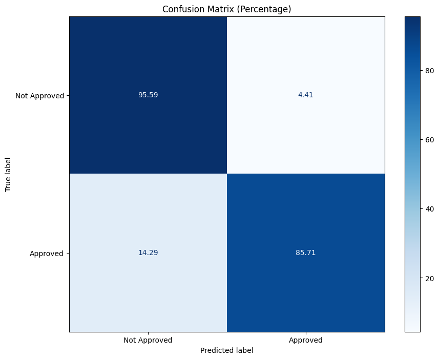

# Credit Approval Model

## Overview
This project implements a stacked ensemble classifier for credit approval prediction. The model combines multiple machine learning algorithms including Gradient Boosting, Random Forest, AdaBoost, and Neural Networks to make accurate credit approval decisions.

## Features
- Advanced data preprocessing with KNN imputation
- Automated feature engineering including:
  - Interaction features
  - Polynomial features (squared and cubic terms)
- Stacked ensemble architecture using:
  - Gradient Boosting Classifier
  - Random Forest Classifier
  - AdaBoost Classifier
  - Multi-layer Perceptron Classifier
- Feature selection using Gradient Boosting
- Comprehensive model evaluation metrics

## Requirements
```
pandas
numpy
scikit-learn
jupyter
```

## Project Structure
```
CREDIT-CARD-APPROVAL/
├── credit/                      # Virtual environment directory
├── credit_approval/             
│   └── crx.data                # Dataset file
├── credit_approval_model.ipynb  # Main notebook with model implementation
├── README.md
└── requirements.txt
```

## Installation
1. Clone the repository:
```bash
git clone https://github.com/yourusername/credit-card-approval.git
cd credit-card-approval
```

2. Create and activate a virtual environment:
```bash
python -m venv credit
source credit/bin/activate  # On Windows, use: credit\Scripts\activate
```

3. Install required packages:
```bash
pip install -r requirements.txt
```

## Usage
1. Ensure the dataset is in the correct directory (`credit_approval/crx.data`)
2. Run the Jupyter notebook:
```bash
jupyter notebook credit_approval_model.ipynb
```

## Model Performance
The current implementation achieves:
- Accuracy: 89.86%
- Precision: 
  - Class 0: 0.86
  - Class 1: 0.95
- Recall:
  - Class 0: 0.96
  - Class 1: 0.84
- F1-Score:
  - Class 0: 0.90
  - Class 1: 0.89

## Model Components

### Preprocessing
- Handles missing values using KNN imputation for numerical features
- Mode imputation for categorical features
- StandardScaler for feature scaling
- Automated categorical encoding

### Feature Engineering
- Creates interaction features between numerical columns
- Generates polynomial features (squared and cubic terms)
- Implements feature selection using Gradient Boosting

### Stacked Ensemble
- Base Models:
  - Gradient Boosting Classifier (100 estimators)
  - Random Forest Classifier (100 estimators)
  - AdaBoost Classifier (100 estimators)
  - Neural Network (100, 50 hidden layers)
- Meta Model:
  - Gradient Boosting Classifier (50 estimators)

## Model Performance


## Contributing
Contributions are welcome! Please feel free to submit a Pull Request.

## License
This project is licensed under the MIT License - see the LICENSE file for details.

## Acknowledgments
- Dataset source: UCI Machine Learning Repository
- This implementation was inspired by various ensemble learning techniques in machine learning literature
